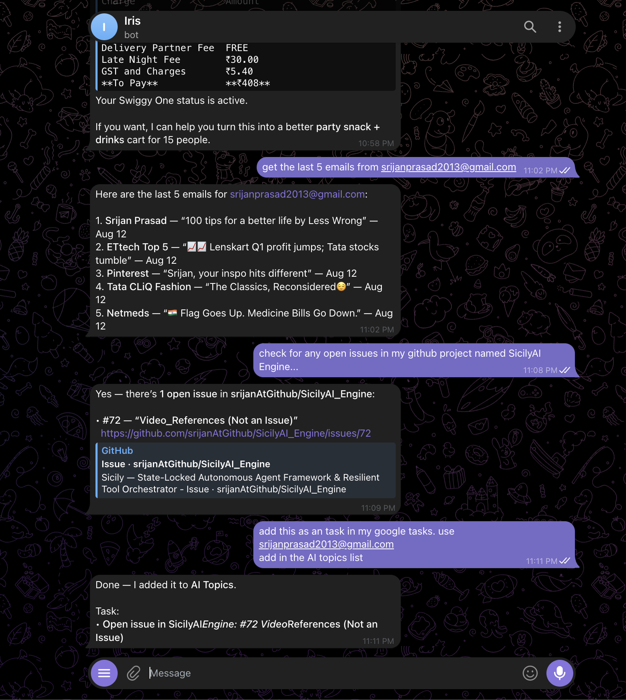
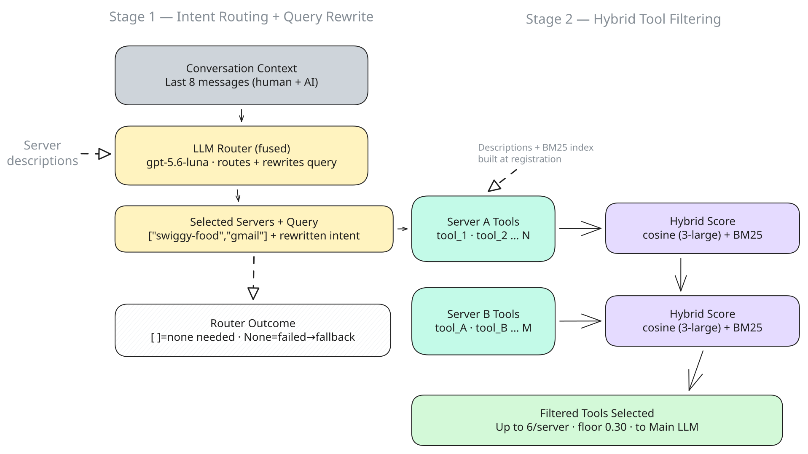
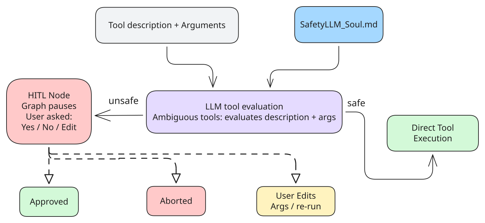

# Sicily — State-Locked Autonomous Agent Framework & Resilient Tool Orchestrator

A production-grade, cost-efficient, and crash-resilient AI runtime powered by **LangGraph** and **Multi-Transport MCP**. Sicily runs in three modes: as a persistent personal **Agent** operating through an asynchronous Telegram interface, as a **Cowork** local terminal assistant with sandboxed access to your files, and as **Navigator**, a browser extension that brings Sicily's writing and research tools to any web page.

> **[→ JUMP TO 'HOW TO USE'](How%20To%20Use.md)**

Sicily is built on four principles:

- **Smart** — understands what you're asking and acts on it, without you having to spell out every step.
- **Helpful** — gets you to a correct, complete answer, not just a plausible-sounding one.
- **Intuitive** — every surface (Agent, Cowork, Navigator) works the way you'd expect on first use, no learning curve.
- **Just works** — no hallucinated tool calls, no silent errors, no drift. Once something breaks trust in a chat, it's hard to earn back — so the system is built to not break it in the first place.

These principles are backed by six mechanisms:

- **Cost-efficient reasoning** — use specialized models, selective context retrieval, and multi-stage tool filtering to maximize accuracy while minimizing token consumption.
- **Scalable tool orchestration** — dynamically retrieve only the tools relevant to the current request, keeping reasoning focused even as the available toolset grows.
- **Persistent memory** — learn user preferences over time and inject only contextually relevant information into conversations.
- **Safe automation** — enforce human approval before executing potentially destructive actions.
- **Operational resilience** — preserve sessions, checkpoints, and scheduled workflows across downtime and infrastructure failures.
- **Local filesystem intelligence** — reason over your files directly from the terminal, with a hybrid RAG engine that searches by meaning, not just keywords.

---

## Sicily Agent

The Telegram interface where the agent lives day-to-day — chat naturally, and Sicily handles context, tools, and approvals behind the scenes. It coordinates external tools, maintains long-term memory, and handles complex multi-step tasks, on-demand or on a schedule.



---

## Sicily Cowork

`sicily start` launches Sicily as a local terminal assistant, sandboxed to whichever directory you run it from. No Telegram, no server, no scheduled tasks — just you and your files.


https://github.com/user-attachments/assets/0747b40f-929a-4504-959a-d72e426f2739

Sicily indexes your files at startup using a **hybrid RAG pipeline** (TF-IDF keyword search + ChromaDB semantic search, merged via Reciprocal Rank Fusion) and uses that index as the first step before reading anything directly. The index is incremental and global — files already indexed from a previous session are reused, not re-embedded.

**What it can do:**

- Read and parse text files, PDFs, Word documents, and Excel spreadsheets
- Inspect directory trees and file metadata
- Search across all your files by meaning, not just filenames
- Create new text files and directories
- Edit existing files line-by-line (with a dry-run preview before any change is applied)
- Copy, move, rename, and delete files (deletes go to a sandbox-local trash folder, never removed outright)
- Pin frequently referenced paths so they survive context summarisation

**What it will never do:**

- Permanently delete a file without first moving it to trash
- Access paths outside the directory you started it in
- Apply edits or destructive actions without showing you a preview first

The sandbox is enforced at the path level — every tool call resolves its target path against the root and rejects anything that would escape it, including symlink traversals.

The same context trimmer and summariser from the main agent runs here too, so long file-heavy sessions stay coherent without ballooning token costs.

---

## Sicily Navigator

Navigator is a Chrome extension that brings Sicily to any web page, backed by a local Sicily server (`sicily navigator --start`).

**Right-click writing tools:** select any text on any page and get Apple-like writing tools in the context menu — rewrite, summarise, or ask a question about the selection, right where you're reading.

https://github.com/user-attachments/assets/4dc44986-9425-4e4a-9964-d18135965dc4

**Side panel:** A persistent panel with its own set of reading and research tools used for chatting, summarising, and organising as you browse — one-click page summaries, one-click tab organisation, and a "find more like this" for surfacing similar pages, plus a reading list to save pages for later.

https://github.com/user-attachments/assets/5f244172-a61f-4287-be19-9bbbb9c7a0ce

Drag snippets into the chat or into topic-based collections, then pull them back in anytime — @ to reference an open tab, # to reference a collection.

https://github.com/user-attachments/assets/2216e3e7-65d6-4e80-b983-561251bbfc70

---

## Architecture Overview

_(Sicily Agent's architecture is shown below — Cowork and Navigator are simpler by design and aren't diagrammed separately.)_


A message arrives via Telegram, passes through the FastAPI backend and session manager, then enters the LangGraph state graph. Inside the graph, the system prepares context (injecting relevant user preferences), fetches only the tools needed for this specific request, reasons with the main LLM, optionally pauses for human approval on destructive actions, executes tools, and sends back a response.

### Handles Unlimited Tools Without Losing Focus

Most agents fall apart as you add more tools — the context window fills up, costs spike, and the model starts hallucinating wrong tool calls. This system solves that with a **two-stage retrieval pipeline** that filters tools _before_ they ever reach the main LLM.



**Stage 1 — Intent routing:** A cheap nano model reads the last few messages and decides which _services_ are relevant right now (e.g. only Swiggy, not Gmail). Everything else is ignored entirely.

**Stage 2 — Semantic filtering:** Within each selected service, tool descriptions are compared to the query using cosine similarity. Only the most relevant tools per service are passed forward.

The result: the main LLM always sees a short, focused list of tools regardless of how many are registered. You can add so many more tools tomorrow from multiple servers and the model won't know or care about the ones that aren't relevant.

### Remembers You — And Gets Better Over Time

The agent builds a personal profile of you automatically. Every session, after you've been idle for some time, an evaluator LLM analyses the conversation and extracts stable behavioural patterns — things like ordering preferences, communication style, time habits, or how you like information presented.


These are stored as a clean flat list in `preferences.md`. When preferences contradict each other (you said you prefer concise responses last month but now you clearly want detail), the merge step resolves the conflict and keeps only the newer version.

On every new session, only the preferences _relevant to your current request_ are retrieved via semantic search and woven into the system prompt. You're not stuffing the context with everything — just what matters right now.

The agent's core personality and tone live separately in `Souls/{name}.md`, which can be swapped out entirely without touching any application logic.

### Never Does Anything Destructive Without Asking

Every tool call goes through a three-gate safety pipeline before execution.



**Gate 1 — Prefix fast-path:** Tools starting with `get_`, `search_`, `read_` are immediately marked safe. No LLM call needed.

**Gate 2 — Heuristic detection:** Tools starting with `update_`, `delete_`, `send_` are flagged as unsafe automatically.

**Gate 3 — LLM safety net:** Anything ambiguous gets evaluated by a dedicated safety LLM that reads the tool description and the arguments being passed.

If a tool is flagged unsafe, the LangGraph graph _pauses_ and asks you: approve, abort, or edit the arguments. Nothing happens until you decide. If a tool hallucinated by the model doesn't exist, the executor catches it cleanly and returns a `ToolMessage` saying "Tool not found" — no graph crashes, no cascading errors.

### Always On — Scheduled Tasks Run 24/7

The agent doesn't just respond to messages. It proactively executes tasks on a schedule, dispatching them into the main agent the same way a user message would be handled.


Tasks are defined in plain YAML — no code changes needed to add, modify, or disable them:

```yaml
- id: morning_news
  enabled: true
  task: "Summarize the top AI news headlines"
  schedule:
    mode: daily
    at: "08:00"
    days: [mon, tue, wed, thu, fri]

- id: email_check
  enabled: true
  task: "Check unread emails and flag anything urgent"
  schedule:
    mode: interval
    every: 30m
    days: [mon, tue, wed]
```

Each enabled task gets its own independent async loop. Schedules support daily execution at a specific time, fixed intervals (minutes or hours), and optional weekday filters.

### Sessions Survive Server Downtime

Sessions are persisted to SQLite and survive crashes, restarts, and planned downtime. On every boot, the system scans all stored sessions and reconciles them: sessions that expired while the server was down are cleaned up, and valid sessions have their idle timers reconstructed from where they left off.

The LangGraph checkpoint store lives in the same database, so the full conversation context is restored exactly where it was — no lost history, no cold-start on reconnect.

On unexpected shutdown, a 10-second graceful drain gives in-flight tasks time to settle their database commits before the process is force-killed.

### Keeps Context Sharp as Conversations Grow Long

Long conversations accumulate fast, especially with tool calls. Once the message history exceeds the token threshold, the context trimmer kicks in.


It walks backward through the message history to find a safe cut point — specifically, it never splits an `AIMessage` (tool call) from its corresponding `ToolMessage` (result), because the OpenAI API rejects sequences where a tool call has no matching result. Everything before the cut is compressed into a single summary message. The active portion of the conversation stays intact.

---

For installation, setup, configuration, and the full CLI reference, see **[How to Use.md](How%20To%20Use.md)**.
